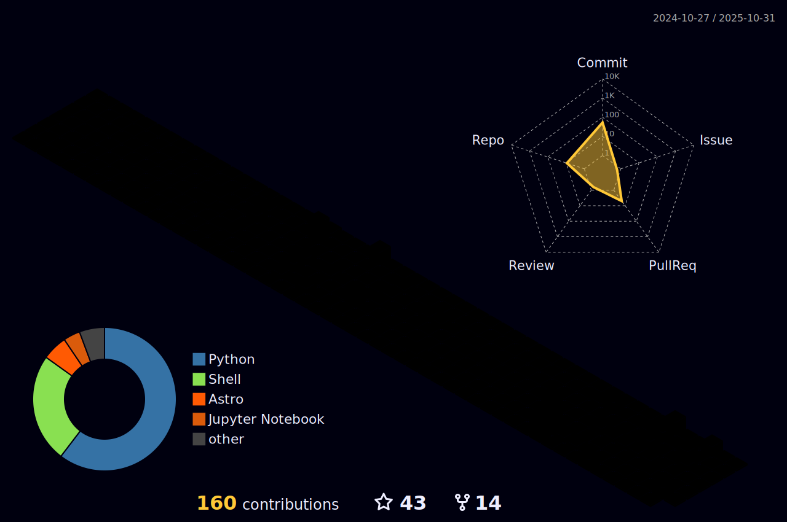

<h1 align="center"> Hello! 👋 I'm Tenten </h1>

  

## My Info
- My name is Thanyapisit Buaprakhong
- Male, 19 Years old.
- live in Bangkok,Thailand

## Position 
- Student at King mongkut's university of Technology Thonburi, Applied Computer Science (Fsci 64)
  - Member of [Google Developer Students Clubs](https://www.facebook.com/gdsc.kmutt)
 
Full List in my [resume](https://tententgc.com)

##  Academic Stuff
-  Graduated from (High School) Princess Chulabhorn's Science High School Pathumthani (PCSHP23) with GPAX of 3.64

## Familiar with:
- JavaScript / TypeScript
- C++
- Python
- Flutter / Dart
- Java

## In domains of:
- Frontend Web
  - React / Next.js
  - Svelte / Svelte Kit
- Backend Web
  - Node: Fastify / Nest.js
  - Go: Fiber
- Mobile
  - Cross Platform: Flutter, React Native
- Database
  - SQL: SQLite / Postgres
  - NoSQL:  MongoDB / Firestore
  
- Additional
  - GraphQL
  
## Feature Projects:
  

 
 Web App

- [tools](https://tools.tententgc.com) - Website for tools easy to create new item
- [Grader](https://grader.tententgc.com) - Online Judge programming course
- [QRCode](https://tools.tententgc.com/QR-%20CodeGenerator/qrcode.html) - Create QR code from link
- [Pomodoro](https://pomodoro.tententgc.com) - Focusing Pomodoro for study
- [Portfolio](https://tententgc.com) - Portfolio of tententgc
- [blog](https://blog.tententgc.com) - article writter platfrom 
- [EventKit](https://github.com/tententgc/eventkit) - Eventkit for help to host and Activity 
- [KepSci](https://github.com/tententgc/KePsci) - ACS Senior project database system

  

 
 Mobile App

 

  

 
Library

 

## Github Stats

Github stats

  
  
  
  

[]
  
  

